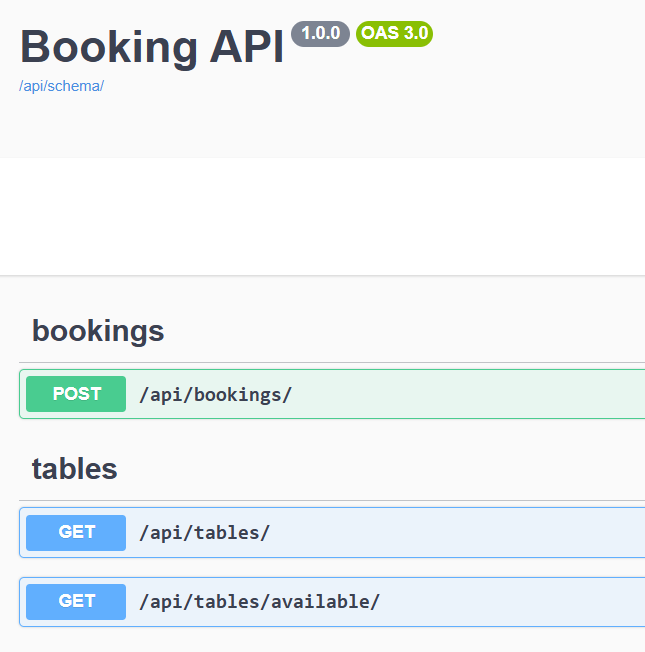

## Getting started

```bash
pip install -r requirements.txt
python manage.py migrate
python manage.py runserver
```

---

## Seed data

A fixture with initial tables is included. Load it with:

```bash
python manage.py loaddata tables
```

---

## API docs

Interactive Swagger UI is available at:

```
/api/docs/
```



---

## Running api tests

```bash
python manage.py test api
```
